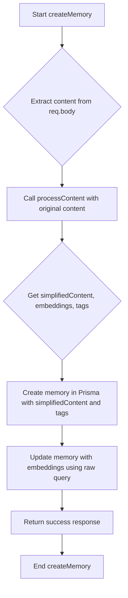

# Implementation Plan: Upgrade Embedding and Tagging

This document outlines the plan to upgrade the embedding and tagging functionality by modifying `src/services/embedding-services.ts` and `src/controllers/memory-controller.ts`.

## Goal

Create a new implementation "Upgrade Embedding and Tagging" by modifying `src/services/embedding-services.ts` and `src/controllers/memory-controller.ts`.

## Detailed Plan

### 1. Modify `src/services/embedding-services.ts`

- [x] **Create a new function `processContent`:** This function now encapsulates the logic for content simplification, embedding generation, and tag generation in a single OpenAI call.
  - **Input:** `originalContent: string`
  - **Output:** `{ simplifiedContent: string, embeddings: number[], tags: string[] }`
- [x] **Implement Content Simplification and Tag Generation (Combined):**
  - Inside `processContent`, use `getOpenAIInstance()` to call `gpt-3.5-turbo` with a single prompt designed to both simplify the `originalContent` and generate relevant tags.
  - The OpenAI response is parsed as a JSON object to extract both `simplifiedContent` and `tags`.
- [x] **Generate Embeddings:**
  - Call the existing `generateEmbeddings` function, passing the `simplifiedContent` as input.
  - Handle potential `null` return from `generateEmbeddings`.
- [x] **Return Values:**
  - Return an object containing `simplifiedContent`, `embeddings`, and `tags`.
- [x] **Error Handling:**
  - Add robust error handling for all steps within `processContent`.

### 2. Modify `src/controllers/memory-controller.ts`

- [x] **Import `processContent`:** Update the import statement to include the new `processContent` function from `src/services/embedding-services.ts`.
- [x] **Update `createMemory` function:**
  - Remove the direct calls to `generateEmbeddings` and `generateTags`.
  - Call the new `processContent` function with `req.body.content`.
  - Destructure the returned `simplifiedContent`, `embeddings`, and `tags`.
  - Use `simplifiedContent` for the `content` field when creating the memory in Prisma (this ensures the simplified version is stored in the existing `memory` table).
  - Use the `embeddings` and `tags` obtained from `processContent` for the respective fields.
  - Update the `embedding` field of the existing `memory` table using the raw query with the `embeddings` generated from the simplified content.

## Mermaid Diagrams

### `processContent` Flow:

```mermaid
graph TD
    A[Start processContent] --> B{Input: originalContent};
    B --> C[Call OpenAI for Content Simplification];
    C --> D{Get simplifiedContent};
    D --> E[Call generateEmbeddings with simplifiedContent];
    E --> F{Get embeddings};
    F --> G[Call generateTags with simplifiedContent];
    G --> H{Get tags};
    H --> I[Return {simplifiedContent, embeddings, tags}];
    I --> J[End processContent];
```

### `createMemory` Flow:


